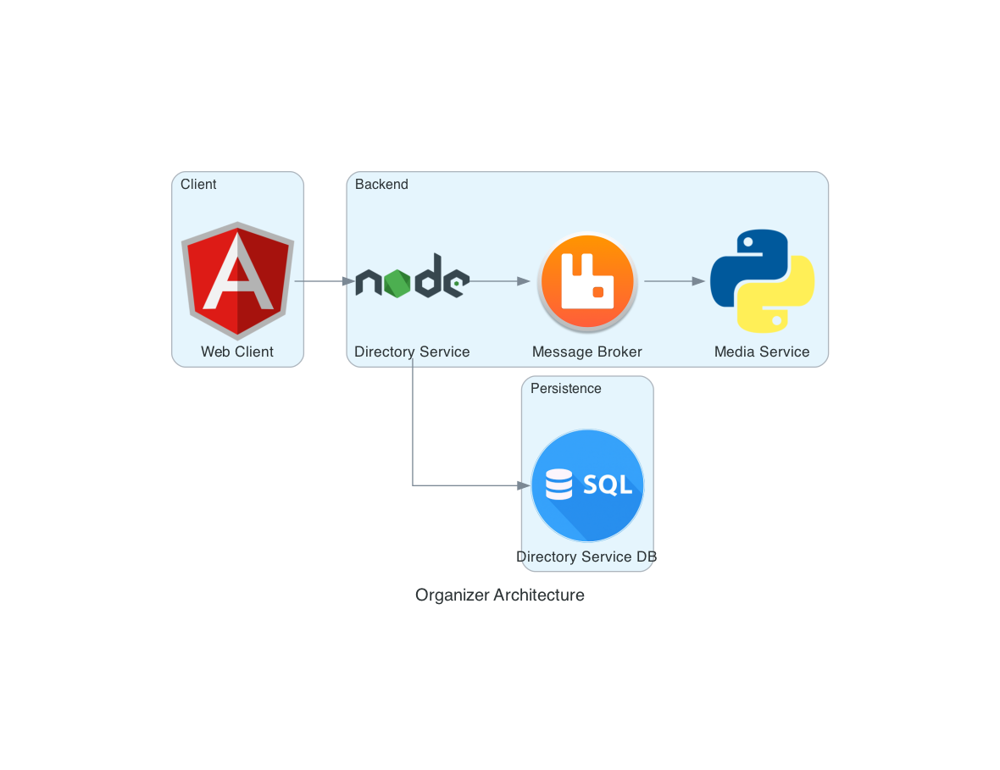

# Organizer

When data needs to be organized

## Description

This app will come in handy if:

- you have a collection of files (e.g. family photos and videos) with names like `img_001`, `0198bef268f57d039fa0` and so on
- you frequenly work on scientific projects, save large amount of different files (.doc, pdf, .png, .mp4) and you need a tool to relate, tag and group them in some way
- when regular mac os finder (or windows file explorer) is just not enough

## Architecture



## Stack

- TypeScript
  - Angular.js, PrimeNG, RxJs
  - Node.js, Nest.js, MicroORM
- Python
  - Pika
  - FastAPI
- SQLite
- RabbitMQ

## Running the app in Docker

```bash
# start
$ docker compose up -d --build

# end
$ docker compose down
```
